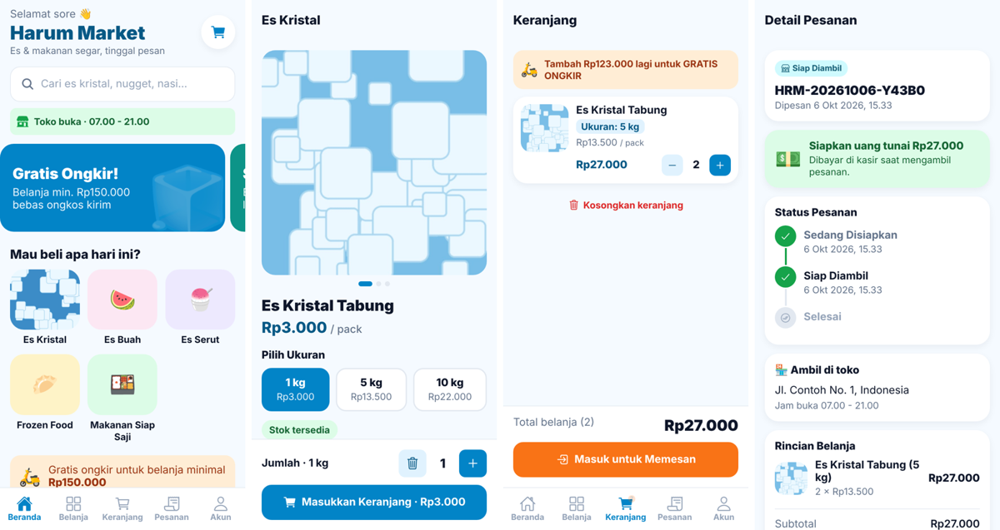
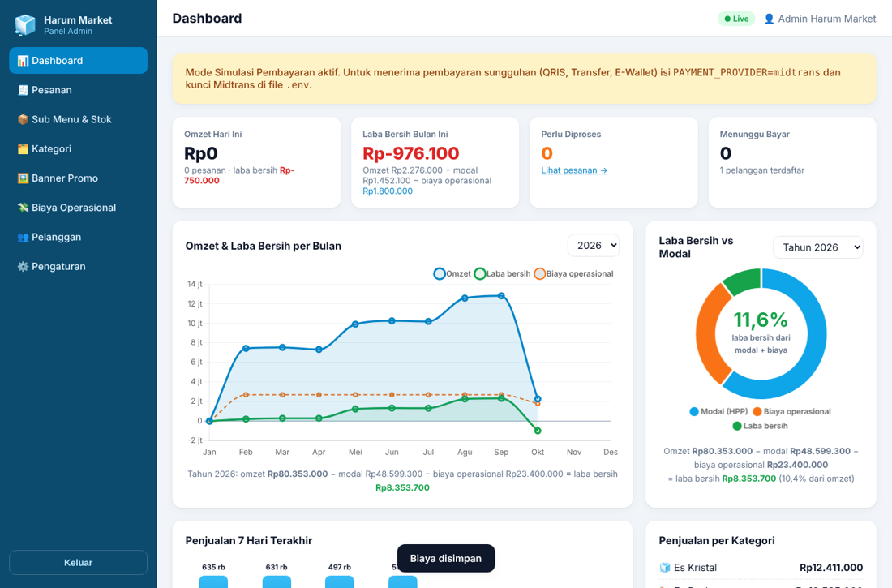
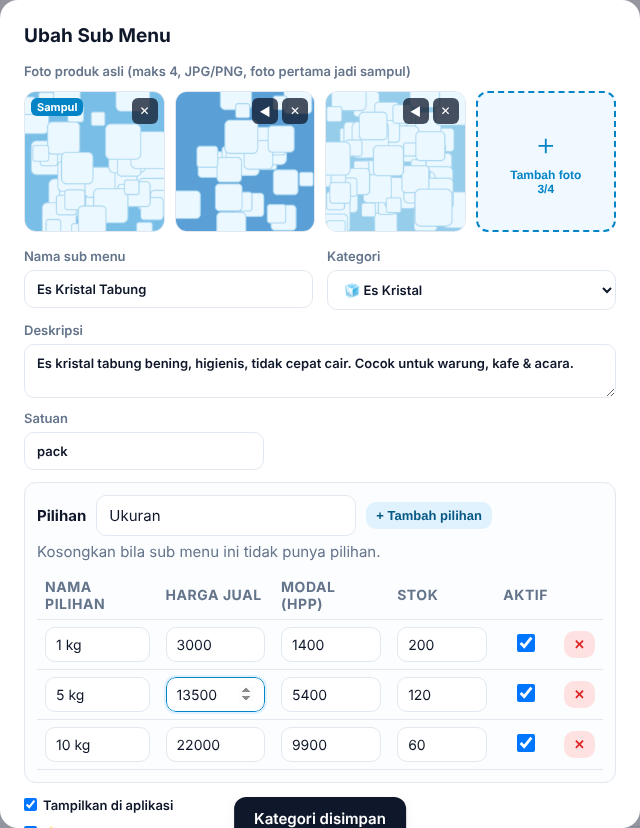

# Harum Market — Aplikasi Belanja Online

**Harum Market** adalah aplikasi belanja online milik **Harum Group** untuk produk es kristal, es buah, es serut, frozen food, dan makanan siap saji.

| Bagian | Folder | Teknologi | Untuk siapa |
|---|---|---|---|
| Aplikasi pelanggan (Android & iPhone) | [`mobile/`](mobile) | Expo / React Native (satu kode untuk Android + iOS) | Pembeli |
| Backend API + Panel Admin web | [`backend/`](backend) | Node.js 22, Express, SQLite | Pemilik & karyawan toko |



## Coba prototype (sebelum publish)

Butuh **Node.js 22.5+** (unduh di <https://nodejs.org>). Di folder utama proyek jalankan:

```bash
npm run demo
```

Perintah ini memasang semua paket, membuat versi web aplikasi pelanggan, mengisi **data contoh** (penjualan 8 bulan + biaya operasional, hanya untuk uji coba), lalu menyalakan server. Buka:

| Alamat | Isi |
|---|---|
| `http://localhost:4000` | Halaman awal (tautan ke aplikasi & admin) |
| `http://localhost:4000/app` | **Aplikasi pelanggan** (versi web, tampilan sama dengan versi HP) |
| `http://localhost:4000/admin` | **Panel admin** — `admin@harumgroup.id` / `admin123` |

Akun pelanggan contoh: `081200000000` / `demo123` (atau daftar akun baru). Pembayaran QRIS/transfer/e-wallet berjalan dalam **mode simulasi** (tidak ada uang sungguhan); pembayaran tunai berjalan normal.

**Uji di HP sungguhan:**
- *Lewat browser HP*: sambungkan HP ke Wi-Fi yang sama dengan komputer, lalu buka `http://<IP-komputer>:4000/app` (IP terlihat di pengaturan Wi-Fi komputer, mis. `192.168.1.5`).
- *Sebagai aplikasi*: pasang **Expo Go** (Play Store / App Store), jalankan `cd mobile && npx expo start`, lalu scan QR-nya.
- *File APK Android* untuk dibagikan ke penguji: `cd mobile && npx eas-cli@latest build -p android --profile preview` (gratis, perlu akun Expo; isi dulu `EXPO_PUBLIC_API_URL` di `mobile/eas.json` dengan alamat server prototype).

**Online tanpa biaya (bisa dibuka siapa saja)**: repo ini sudah berisi `Dockerfile` & `render.yaml`. Di <https://render.com> (paket gratis) pilih *New → Blueprint* → hubungkan repo GitHub ini → isi password admin → *Apply*. Hasilnya alamat seperti `https://harum-market.onrender.com` berisi aplikasi pelanggan (`/app`), panel admin (`/admin`) dan data contoh. Catatan paket gratis: server tidur setelah 15 menit tidak dipakai (bangun ±1 menit) dan data kembali ke awal setiap restart — cukup untuk uji coba, bukan untuk toko yang sudah beroperasi.

Pada prototype, ubahan di panel admin (sub menu, foto, harga, kategori, banner, pengaturan) dan perubahan status pesanan **langsung tampil** di aplikasi pelanggan yang sedang terbuka — tanpa refresh.

## Fitur

**Aplikasi pelanggan**
- Tampilan sederhana dengan huruf & tombol besar, ramah untuk semua umur
- Beranda: banner promo, kategori (dengan gambar asli dari admin), produk terlaris, status toko buka/tutup
- Cari produk, filter per kategori; detail sub menu dengan **galeri foto** (geser, maks 4) dan **pilihan** ukuran / rasa / porsi — harga & stok mengikuti pilihan
- **Realtime**: perubahan dari admin dan status pesanan langsung tampil tanpa refresh
- Keranjang tersimpan di HP, info "kurang Rp… lagi untuk gratis ongkir"
- Checkout 3 langkah: **diantar / ambil di toko** → **cara bayar** → catatan
- Pembayaran **QRIS**, **Transfer Bank (Virtual Account BCA, BNI, BRI, Mandiri, Permata)**, **E-Wallet (GoPay, ShopeePay)**, dan **Tunai** (bayar ke kurir saat pesanan sampai / di kasir saat ambil sendiri); QRIS juga bisa dibayar pakai OVO, DANA, LinkAja & semua m-banking
- Alamat bisa ditandai di **peta** (geser/ketuk peta, cari nama jalan, atau "Gunakan Lokasi Saya"); ongkir dihitung otomatis dari jarak tempuh
- Status pembayaran terkonfirmasi otomatis, lacak status pesanan (dibayar → disiapkan → diantar/siap diambil → selesai)
- Riwayat pesanan, pesan lagi, simpan banyak alamat, tanya toko via WhatsApp
- Daftar cukup nama + nomor HP

**Panel admin** (`http://<server>:4000/admin`)
- Dashboard: omzet & **laba bersih** hari ini / bulan ini, **grafik garis omzet, laba bersih & biaya operasional per bulan** (pilih tahun; arahkan kursor atau sentuh titik untuk melihat omzet, modal, laba kotor, biaya operasional, laba bersih, margin & jumlah pesanan), **diagram donat** modal (HPP) / biaya operasional / laba bersih dengan persentase laba bersih terhadap modal + biaya (bulan ini / tahun / semua waktu), grafik 7 hari, penjualan per kategori, produk terlaris, stok menipis
- **Biaya operasional**: catat gaji, listrik & air, sewa, bensin, kemasan, dll. per tanggal; ringkasan per jenis biaya; "Salin biaya bulan lalu" untuk biaya rutin. **Laba bersih = omzet − modal (HPP) − biaya operasional** — dipakai di semua angka laba & grafik
- Indikator **● Live** — pesanan baru muncul seketika dengan bunyi notifikasi
- Kelola pesanan: filter status, cari, ubah status, konfirmasi bayar manual, batalkan (stok kembali otomatis), tombol WhatsApp pelanggan; notifikasi bunyi saat ada pesanan baru dibayar
- **Sub menu & stok**: tiap kategori berisi sub menu (mis. *Es Kristal → Es Kristal Tabung, Es Balok*; *Makanan Siap Saji → Nasi Ayam Geprek, Nasi Goreng*). Tiap sub menu: **maksimal 4 foto asli** (atur urutan, foto pertama jadi sampul), dan **pilihan** opsional (Ukuran 1 kg / 5 kg / 10 kg, Rasa, Porsi…) yang masing-masing punya harga jual, **harga modal (HPP)** dan stok sendiri; ubah stok langsung di daftar
- **Kategori**: unggah **1 gambar** sebagai pengganti ikon
- Pesanan tunai: muncul sebagai "Sedang Disiapkan" dengan keterangan "Tagih tunai Rp…"; otomatis tercatat **lunas** saat pesanan diselesaikan
- Kategori, banner promo, daftar pelanggan
- Pengaturan: nama toko, jam buka, buka/tutup toko, aktif/nonaktif pembayaran tunai, gratis ongkir, minimal belanja, batas waktu bayar
- **Ongkir**: tarif tetap, atau **sesuai jarak tempuh di peta** — tandai lokasi toko di peta, atur tarif dasar untuk N km pertama + tarif per km + jarak maksimal, lalu uji dengan mode "Cek ongkir ke titik"





## Menjalankan di komputer (development)

Butuh **Node.js 22.5+**.

### 1. Backend + panel admin

```bash
cd backend
cp .env.example .env      # lalu sesuaikan isinya
npm install
npm start
```

- API: `http://localhost:4000/api`
- Panel admin: `http://localhost:4000/admin` — login awal `admin@harumgroup.id` / `admin123` (**ganti** lewat `.env` sebelum dipakai sungguhan)
- Saat pertama jalan, database diisi contoh katalog Harum Market (bisa diubah/hapus dari panel admin).
- Tes otomatis: `npm test`

Catatan: atur zona waktu server ke WIB (`TZ=Asia/Jakarta`) agar laporan harian/bulanan tepat.

### 2. Aplikasi mobile

```bash
cd mobile
npm install
npx expo start
```

Scan QR yang muncul dengan aplikasi **Expo Go** (Android/iPhone). HP dan komputer harus di jaringan Wi-Fi yang sama — aplikasi otomatis memakai IP komputer port 4000 sebagai alamat backend. Untuk backend di server lain, isi `EXPO_PUBLIC_API_URL` (lihat `mobile/.env.example`).

Cek kode: `npm run lint`.

## Pembayaran (QRIS, Transfer, E-Wallet)

Backend memakai payment gateway **Midtrans** (resmi Bank Indonesia, mendukung QRIS, Virtual Account, GoPay, ShopeePay). Ada 2 mode di `backend/.env`:

| `PAYMENT_PROVIDER` | Kegunaan |
|---|---|
| `simulator` (bawaan) | Uji coba tanpa uang sungguhan. Halaman bayar menampilkan QR / nomor VA contoh dan tombol "Simulasikan Pembayaran Berhasil". **Jangan dipakai di produksi.** |
| `midtrans` | Pembayaran sungguhan |

Langkah mengaktifkan Midtrans:
1. Daftar di <https://dashboard.midtrans.com>, lengkapi data usaha.
2. Ambil **Server Key** & **Client Key** (Settings → Access Keys). Mulai dengan mode *Sandbox* untuk uji coba.
3. Isi di `backend/.env`:
   ```
   PAYMENT_PROVIDER=midtrans
   MIDTRANS_SERVER_KEY=SB-Mid-server-xxxx
   MIDTRANS_CLIENT_KEY=SB-Mid-client-xxxx
   MIDTRANS_IS_PRODUCTION=false   # ubah ke true setelah akun production disetujui
   PUBLIC_URL=https://api.harumgroup.id
   ```
4. Di dashboard Midtrans → Settings → Payment → *Notification URL*, isi:
   `https://api.harumgroup.id/api/payments/midtrans/notification`
5. Aktifkan channel QRIS, GoPay, ShopeePay dan Virtual Account yang diinginkan di dashboard Midtrans.

Alur: pelanggan pilih metode → backend membuat transaksi Midtrans → aplikasi membuka halaman pembayaran → Midtrans mengirim notifikasi (diverifikasi signature SHA-512) → pesanan otomatis berstatus **Pembayaran Diterima**. Pesanan yang tidak dibayar sampai batas waktu otomatis dibatalkan dan stok dikembalikan.

## Ongkir berdasarkan jarak (peta)

1. Panel admin → **Pengaturan** → *Pengiriman & Ongkir* → pilih **Ongkir sesuai jarak tempuh (peta)**.
2. Klik peta (atau cari alamat / "Lokasi saya") untuk menandai lokasi toko, isi tarif, lalu **Simpan**.
3. Pelanggan menandai titik alamatnya di peta saat menambah alamat. Ongkir = tarif dasar untuk N km pertama + tarif per km berikutnya (dibulatkan ke atas per km). Alamat di luar jarak maksimal ditolak dengan saran "ambil di toko". Gratis ongkir tetap berlaku.

Jarak tempuh dihitung mengikuti rute jalan:
- **OSRM / OpenStreetMap** (bawaan, gratis, tanpa API key). Server demo publik OSRM cocok untuk mulai; untuk volume besar sebaiknya pakai server OSRM sendiri (`OSRM_URL`) atau Google.
- **Google Maps Distance Matrix** — isi `GOOGLE_MAPS_API_KEY` di `backend/.env` (aktifkan *Distance Matrix API* di Google Cloud).
- Bila layanan peta tidak bisa dihubungi, sistem memakai perkiraan (jarak garis lurus × 1,3) dan menandainya "(perkiraan)".

Semua komponen peta **gratis tanpa API key**: tampilan peta OpenStreetMap + Leaflet, pencarian alamat Nominatim, dan rute OSRM. Google Maps hanya opsional bila kelak dibutuhkan. Layanan publik gratis ini punya batas wajar pemakaian — cukup untuk toko yang baru mulai; bila pesanan sudah sangat ramai, pertimbangkan server OSRM sendiri atau penyedia berbayar.

## Menerbitkan ke Play Store & App Store

1. Siapkan backend di server/VPS dengan domain HTTPS (mis. `https://api.harumgroup.id`), jalankan dengan `NODE_ENV=production`, isi `JWT_SECRET` acak yang panjang, dan **backup file database** (`backend/data/harum.db`) & folder `backend/uploads` secara rutin.
2. Ubah `EXPO_PUBLIC_API_URL` di `mobile/eas.json` ke domain backend Anda.
3. Ganti ikon & splash di `mobile/assets/` dengan logo Harum Market.
4. Build di cloud dengan EAS (tidak perlu Android Studio / Mac):
   ```bash
   cd mobile
   npx eas-cli@latest login
   npx eas-cli@latest build -p android --profile preview      # APK untuk dicoba di HP
   npx eas-cli@latest build -p android --profile production   # AAB untuk Play Store
   npx eas-cli@latest build -p ios --profile production       # untuk App Store (butuh Apple Developer)
   npx eas-cli@latest submit -p android   # / -p ios
   ```
   Butuh akun Google Play Console (sekali bayar) dan Apple Developer Program (tahunan).

## Struktur kode

```
backend/
  src/server.js            entry point (port 4000)
  src/app.js               rute Express
  src/db.js                skema SQLite
  src/routes/              auth, katalog, pelanggan (/api/me), admin (/api/admin), pembayaran (/pay, webhook)
  src/services/orders.js   logika pesanan, stok, status
  src/services/payment.js  integrasi Midtrans + simulator + tunai
  src/services/shipping.js ongkir per jarak (OSRM / Google / perkiraan)
  src/services/catalog.js  sub menu, pilihan (varian), foto
  src/realtime.js          sinkronisasi realtime (WebSocket /ws)
  src/demo.js              data contoh untuk prototype (npm run demo:data)
  public/map-picker.html   halaman peta pemilih titik alamat (dipakai aplikasi)
  public/admin/            panel admin (HTML/CSS/JS, tanpa build)
  test/                    tes API end-to-end (npm test)
mobile/
  src/app/                 layar-layar (Expo Router): (tabs)/ beranda, belanja, keranjang, pesanan, akun; checkout, payment, order, login, ...
  src/components/ui.js     komponen UI (tombol besar, kartu produk, stepper jumlah, dll)
  src/context/             sesi login, keranjang, info toko, koneksi realtime
  src/lib/                 API client, tema warna, format rupiah
```

## Ringkasan API

| Method & path | Keterangan |
|---|---|
| `POST /api/auth/register`, `POST /api/auth/login`, `GET/PUT /api/auth/me` | Akun |
| `GET /api/store`, `/api/categories`, `/api/products?category=&q=&featured=1&ids=`, `/api/products/:id`, `/api/banners` | Katalog (publik; sub menu berisi `images[]` & `variants[]`) |
| `WS /ws?token=` | Notifikasi realtime: `catalog` (products/categories/banners/store) & `order` (hanya pemilik pesanan + admin) |
| `GET/POST/PUT/DELETE /api/me/addresses` | Alamat pelanggan |
| `POST /api/me/checkout/quote` | Hitung subtotal, ongkir, total |
| `POST /api/me/orders`, `GET /api/me/orders`, `GET /api/me/orders/:code`, `POST /api/me/orders/:code/cancel` | Pesanan pelanggan |
| `POST /api/payments/midtrans/notification` | Webhook Midtrans |
| `/api/admin/*` | stats (omzet, modal, biaya operasional, laba bersih per bulan), orders, products (multipart: `images` maks 4, `image_order`, `variants`), variants/:id/stock, categories (multipart `image`), expenses, banners, customers, settings, shipping/preview (khusus admin) |
